# Custom Widget - Add Layer Widget
___

1)	Navigate to the **C:\ArcGISExperienceBuilder\client\your-extensions\widgets\samplewidgets** folder.  Then, make a copy of the **simple** folder and call it **add-layers**.

2)	The widgets folder should look like this.

    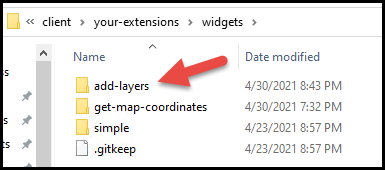

3)	Now open **VS Code**.  It can be found here in the Start menu.

    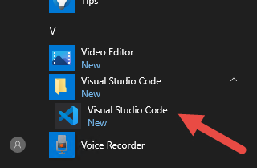

4)	Go to **File -> Open Folder...**

    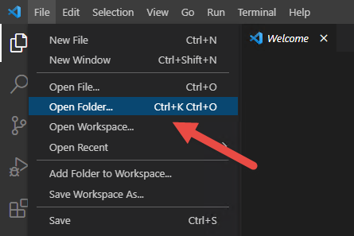
    
5)	Navigate to the **C:\ArcGISExperienceBuilder** folder and select it.  You should now see all the Experience Builder folders in VS Code as seen here.

    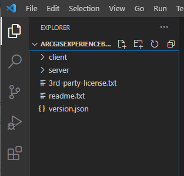
    
6)	Inside VS Code navigate to **your-extensions->themes->add-layers** folder.  Your VS left window should look like this.

    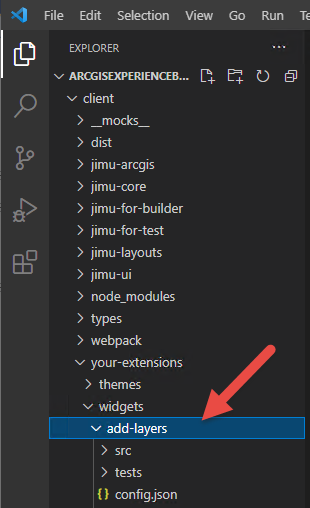

7)	Double click the **manifest.json** file.  Change the **name** parameter to **"add-layers"**.  Also, change the **author** to your name and alter the **"description"** parameter to something like you see in the image.

    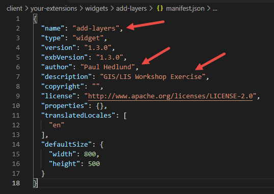
    
8)	Also, add a new tag called **dependency** with the setting as **"jimu-arcgis"**.  This indicates that the ArcGIS JavaScript API will be referenced as part of this widget.

    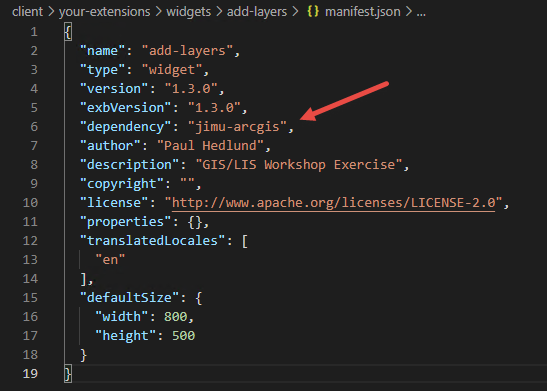

9)	Delete the **tests** folder as it is not needed.  Right-click on the folder and delete as seen here.

    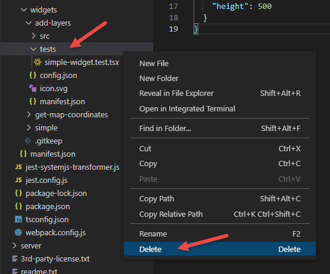
    
10)	Add a new folder within **src** called **setting**.  Right-click to add the folder as seen here.

    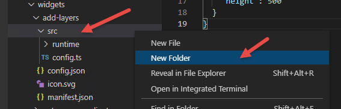
    
11)	Add a new file within the **setting** folder called **setting.tsx**.  Right-click to add the file as seen here.

    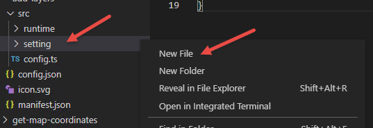
    
12)	Click on the **setting.tsx** file to edit it.  Start by adding the import statements text from here.
  
    ```
    /** @jsx jsx */
    import { React, jsx } from "jimu-core";
    import { BaseWidgetSetting, AllWidgetSettingProps } from "jimu-for-builder";
    import { JimuMapViewSelector } from "jimu-ui/advanced/setting-components";
    ```
    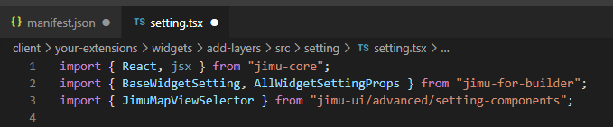
    
13)	Next, add the **BaseWidgetSetting** class.
  
    ```
    export default class Setting extends BaseWidgetSetting<AllWidgetSettingProps<any>, any> {
        onMapWidgetSelected = (useMapWidgetIds: string[]) => {

        };
        render() {
          return (

          );
        }
      }
    ```
    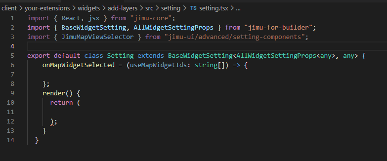
    
14)	Now define the **onMapWidgetSelected** function.

    Add the below code here:
    
  
    ```
    this.props.onSettingChange({
      id: this.props.id,
      useMapWidgetIds: useMapWidgetIds
    });
    ```
    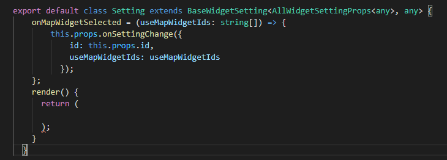
    
15)	Finally, add code to the **render** function.

    Add the below code here:
    
  
    ```
      <div className="widget-setting-demo">
        <JimuMapViewSelector useMapWidgetIds={this.props.useMapWidgetIds} onSelect={this.onMapWidgetSelected} />
      </div>
    ```
    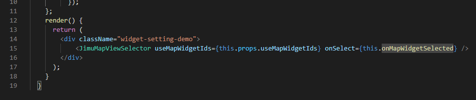
    
16)	At this point do a **File -> Save All** within VS Code.

17)	Now navigate to the **runtime -> widget.tsx** file.  Remove the existing sample code from that file.

    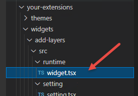
    
18)	Remove the existing sample code from the **widget.tsx** file.
    
19)	Start by adding the import statement text. Notice the **"jimu-arcgis"** base on the depency we added in the **Manifest.json**.
  
    ```
    /** @jsx jsx */
    import { AllWidgetProps, BaseWidget, jsx } from "jimu-core";
    import { JimuMapViewComponent, JimuMapView } from "jimu-arcgis";
    import FeatureLayer = require("esri/layers/FeatureLayer");
    ```
    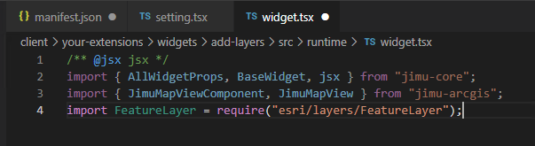
     
20)	Next, add the **BaseWidgetSetting** class.
  
    ```
    export default class Widget extends BaseWidget<AllWidgetProps<any>, any> {


      render() {
        return (

        );
      }
    }
    ```
    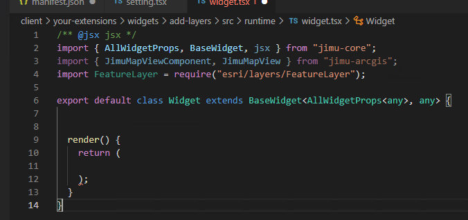
    
21)	Next, add the **BaseWidgetSetting** class.
  
    ```
    export default class Widget extends BaseWidget<AllWidgetProps<any>, any> {


      render() {
        return (

        );
      }
    }
    ```
    
    
22)	Now add the state code logic within the class.
  
    ```
      state = {
        jimuMapView: null
      };
      activeViewChangeHandler = (jmv: JimuMapView) => {
        if (jmv) {
          this.setState({
            jimuMapView: jmv
          });
        }
      };
    ```
    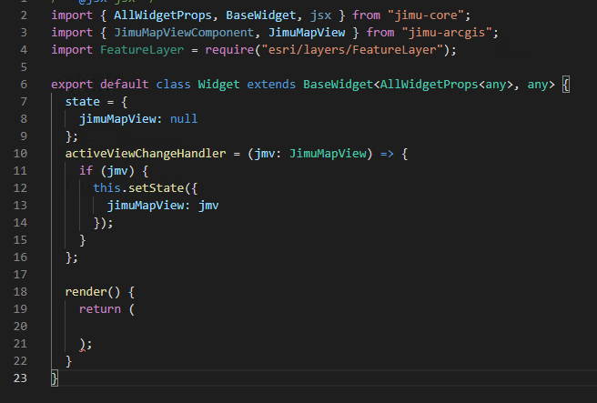
    
23)	Now add the button submit logic below the state code.
  
    ```
      formSubmit = (evt) => {
        evt.preventDefault();
        // create a new FeatureLayer
        const layer = new FeatureLayer({
          url: "add-service-here"
        });

        // Add the layer to the map (accessed through the Experience Builder JimuMapView data source)
        this.state.jimuMapView.view.map.add(layer);
      };
    ```
    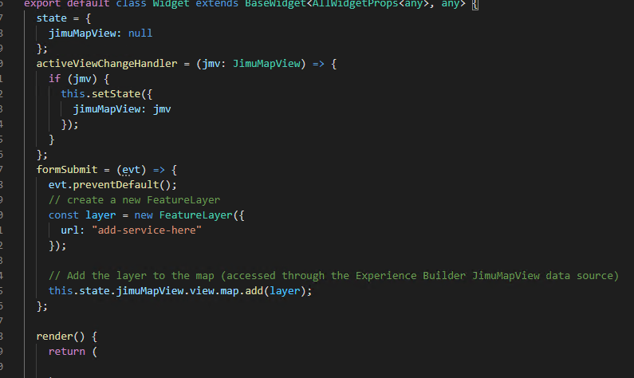
    
24)	Now add the **render** logic.
  
    ```
      <div className="widget-starter jimu-widget">
        {this.props.hasOwnProperty("useMapWidgetIds") && this.props.useMapWidgetIds && this.props.useMapWidgetIds.length === 1 && (
          <JimuMapViewComponent useMapWidgetIds={this.props.useMapWidgetIds} onActiveViewChange={this.activeViewChangeHandler} />
        )}
        <form onSubmit={this.formSubmit}>
          <div>
            <button>Add Layer</button>
          </div>
        </form>
      </div>
    ```
    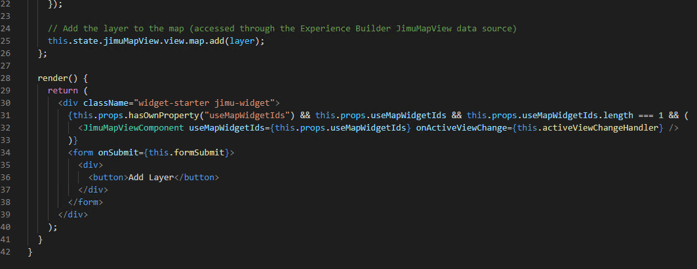
    
25)	Let's now add the service layer we will reference from our ArcGIS Online account.  This is a service of all Minnesota airport locations.  Add it to the URL for the **FeatureLayer**.

    ```
    https://services.arcgis.com/8df8p0NlLFEShl0r/arcgis/rest/services/MN_Airports/FeatureServer/0
    ```
    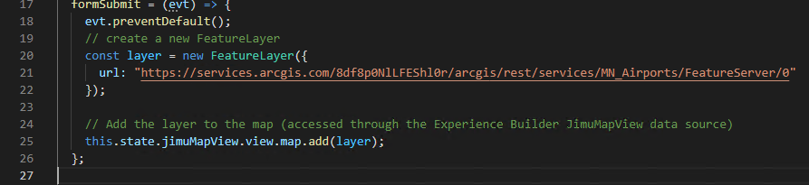
    
26)	Delete the **config.ts** file as this is not needed.

    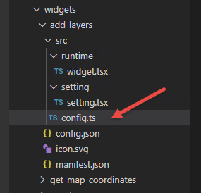
    
27)	In the **config.json** file remove everything within the brackets.

    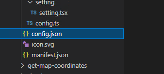
    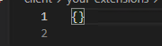
    
28)	At this point do a **File -> Save All** within VS Code.

29) If you do not have your command prompt open from the previous exercise than follow steps #4 through #8 on the **Add Get Map Coordinates Widget** exercise.

30) If your command prompts are already open than do **ctrl + c** and say **Y**.  This will terminate the batch job  Then, run **npm start** again.

    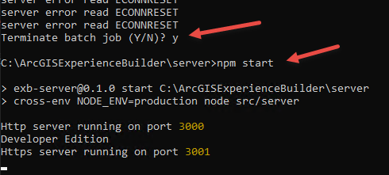
    
31)  Open a browser and type the URL **localhost:3001**.  If you are not signed-in you will see this window.  Go ahead and **Sign in**.

    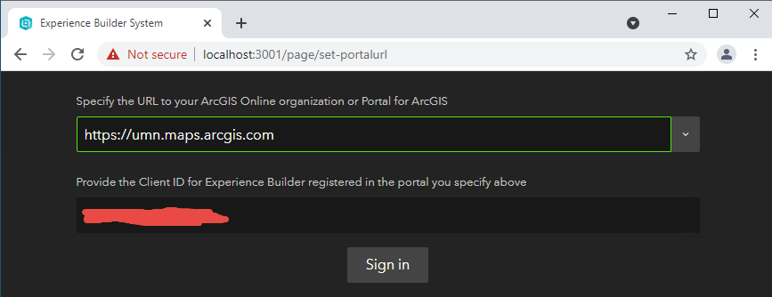
    
32)  At this point you should see the ArcGIS Experience Builder (Developer Edition) main page.  Click the **+ Create New** button.

    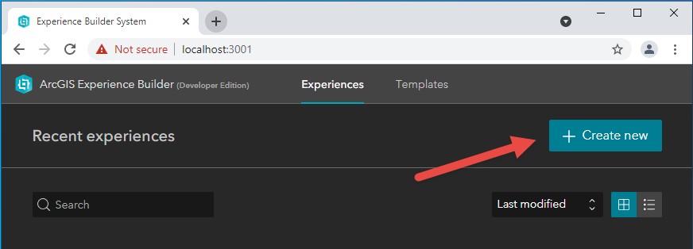
    
33) Select the **Blank fullscreen** template.

    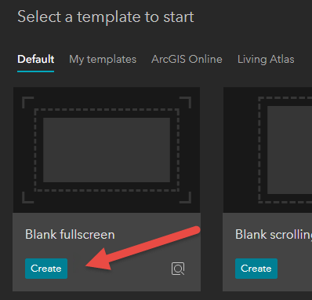
    
34) Drag the **Map** widget onto the main window.

    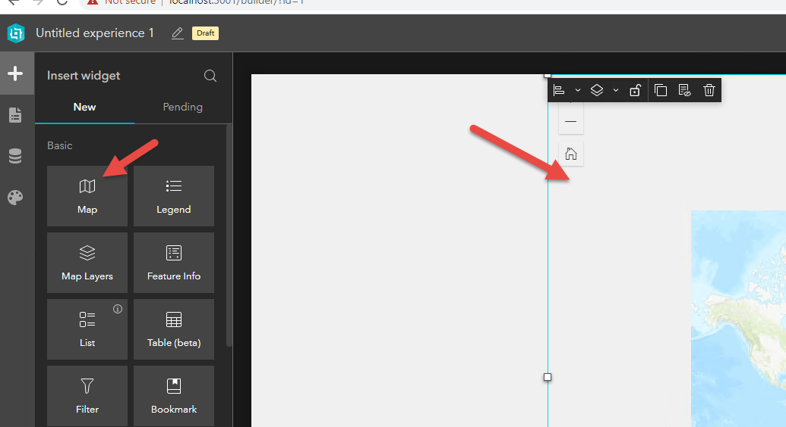
    
35) Go to the right and side of the Experience and find the **Initial View** setting and select **Custom** and then click **Modify**.

    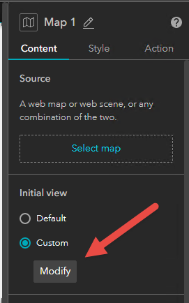
    
36) Zoom the map into Minnesota and click  **OK**.

    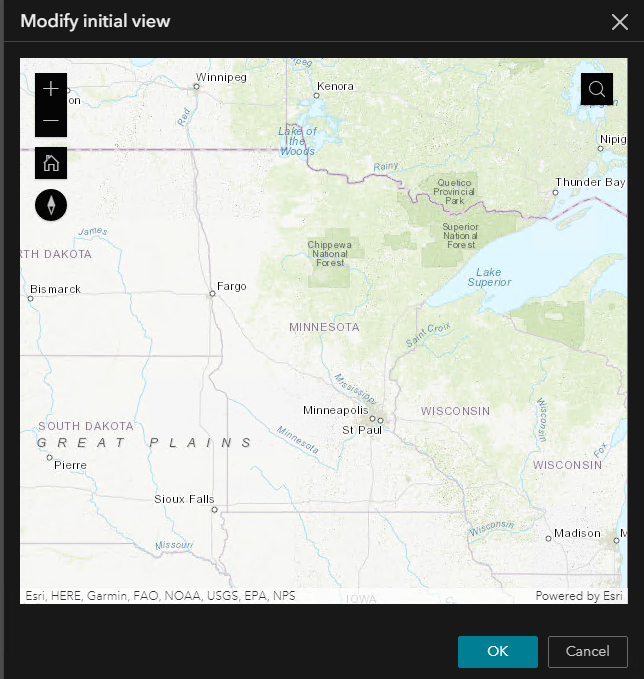
    
37) Now find your newly created **add-layers** widget and drag it onto the left side of the window.

    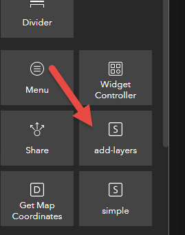
    
38) In the content section on the right side configuration window select **Map 1**.

    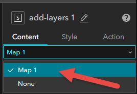
    
38) Click the save button and then click preview.

    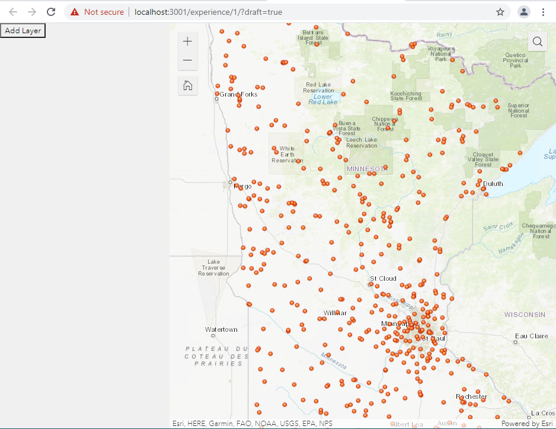
    
39) On the preview click the **Add Layer**.  You should now see a map with the MN Airport points.

    
    
40) Congrats!  You just coded your first custom Experience Builder widget.

41) Have extra time?  Learn about make a custom **icon.svg** for your widget.  There several ways to create one.  You could start by trying an online editor such as this one (https://mediamodifier.com/free-svg-editor).


