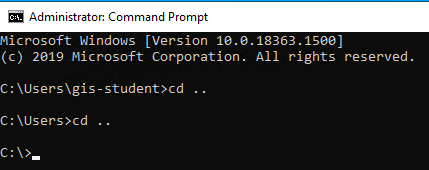

# Custom Widget - Add Layer Widget
___

1)	Navigate to the **C:\ArcGISExperienceBuilder\client\your-extensions\widgets\samplewidgets** folder.  Then, make a copy of the **simple** folder and call it **add-layers**.

3)	The widgets folder should look like this.

    

4)	Open the command prompt.  This can be done by typing **cmd** in the Windows search box.

    

5)	Type **cd ..** two times to get to main **C:\** folder.

    
