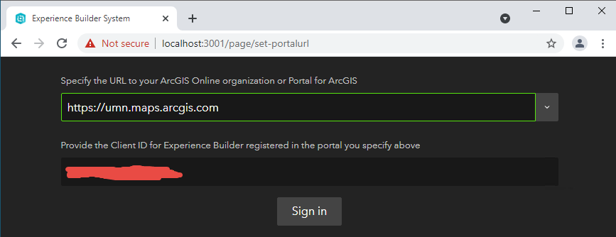
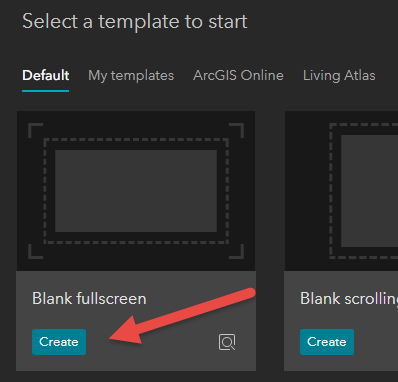

# Add Get Map Coordinates Widget
___

1)	Download the widget from [here][download]

2)	Navigate to **C:\ArcGISExperienceBuilder\client\your-extensions\widgets\samplewidgets**  Place the zip file in this folder and unzip it.  Then, delete the zip file.

3)	The **widgets** should look like this

    

4)	Open the command prompt.  This can be done by typing **CMD** in the Windows search box.

    

5)	Type **cd ..** two times to get to main **C:\** folder.

    
 
6)  Then, type **cd C:\ArcGISExperienceBuilder\server** to get to the server folder.

    
    
7)  Type **nmp start** to start the Node.js service

    
    
8)  A second command prompt will need to be opened.  Therefore, go through steps #4 to #7 again.  However, for #6 change the command to **cd C:\ArcGISExperienceBuilder\client**.

    
    
8)  Open a browser and type the URL **localhost:3001**.  If you are not signed-in you will see this window.  Go ahead and **Sign in**.

    
    
9)  At this point you should see the **ArcGIS Experience Builder (Developer Edition)** main page.  Click the **+ Create New** button.

    
    
10) Select the **Blank fullscreen** template.

    
    
11) Drag the **Map** widget onto the right side of the screen control.

    
    
12) Find the newly added **Get Map Coordinates** widget and drag it to the left side of the screen control.

    
    
13) One the right side of the configuration screen select **Map 1** from the **Content** section.

    
    
14) Save the Experience than click the **Preview** button.

    
    
15) On the web page hover your mouse over the map to see the Lat/Long, Zoom and Scale information.

    
    
16) You have successfully added a custom widget!  Now go ahead and try the next excersis on coding a custom widget.

    
[download]: https://github.com/paulhedlund/experiencebuilderGISLIS/blob/main/Exercises/docs/get-map-coordinates.zip?raw=true
